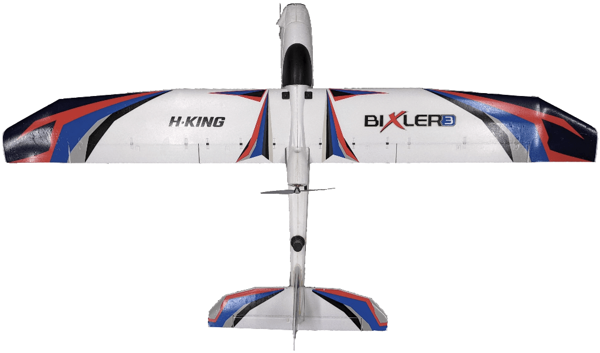

# LIS Vision Flight

Open source, simple fixed-wing drone for vision-based flight experiments

The LIS Vision flight project aims to give easy access to a vision-based fixed-wing drone to conduct experiments. It features

- a global shutter camera for vision-based applications
- an oboard single board computer to process vision data and for control
- a flow sensor and a point lidar for vision-based pose estimation
- a high precision RTK GNSS to provide ground truth data
- airspeed sensor for estimates of wind speeds
- a telemetry radio for communication with a ground station
- a PX4 autopilot that handles
  - sensor reading
  - actuator commanding
  - state estimation
  - time-synced camera triggering
  - attitude control
  - communication for RTK corrections

## Hardware

Instructions for building the drone can be found in [hardware](./hardware).

## Software

Find the instructions for the software setup in [software](./software).

## Citation

``` bibtex
@inproceedings{wueest2018accurate,
  title={Accurate Vision-based Flight with Fixed-Wing Drones},
  author={W{\"u}est, Valentin and Ajanic, Enrico and M{\"u}ller, Matthias and Floreano, Dario},
  booktitle={2022 IEEE/RSJ International Conference on Intelligent Robots and Systems (IROS)},
  year={2022},
  organization={IEEE}
}
```
