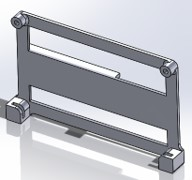
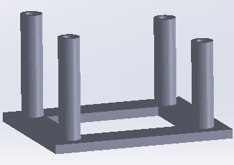
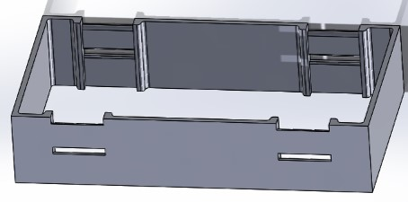

# Hardware
## Parts list

We first provide a list of hardware components. The prices listed are based on online prices on March 11, 2022 and are listed in Euros.

### Body and actuation
| Part Function                     | Article Name                            | Amount | Price | Total Price |
| --------------------------------- | --------------------------------------- | :----: | ----: | ----------: |
| fixed-wing plane                  | H-King Bixler 3 Glider 1550mm (61") Kit |   1    |   100 |         100 |
| wing servos                       | Corona CS-929MG                         |   2    |     6 |          12 |
| elevator, rudder servo            | Corona DS-919MG                         |   2    |     5 |          10 |
| thrust motor                      | Scorpion SII-2212-1400 KV (V2)          |   1    |    42 |          42 |
| propeller                         | GWS EP-8040                             |   1    |     5 |           5 |
| electronic speed controller (ESC) | Flycolor X-Cross Slim BL32 36A          |   1    |    14 |          14 |
| battery                           | NVision LiPo 2400 mAh 3S 35C            |   1    |    22 |          22 |
| power module                      | Micro Power Module (PM06 v2)            |   1    |    15 |          15 |
|                                   |                                         |        |       |     **220** |

### Autopilot 
| Part Function        | Article Name                                                   | Amount | Price | Total Price |
| -------------------- | -------------------------------------------------------------- | :----: | ----: | ----------: |
| autopilot            | Pixhawk 4 (plastic case)                                       |   1    |   168 |         168 |
| RC receiver          | FrSky R-XSR 2.4GHz 16CH ACCST                                  |   1    |    21 |          21 |
| telemetry            | Transceiver Telemetry Radio V3 500mW Telemetry Radio V3 433MHz |   1    |    51 |          51 |
| airspeed sensor      | Sensirion SDP33 kit                                            |   1    |    40 |          40 |
| GNSS antenna         | Drotek DA233                                                   |   1    |    70 |          70 |
| GNSS module          | Drotek DP0601                                                  |   1    |   170 |         170 |
| GNSS extension cable | 415-0031-MM250                                                 |   1    |    15 |          15 |
| GNSS cable adapter   | ADP-SMAM-SMAF90                                                |   1    |     6 |           6 |
| sd card autopilot    | Sandisk Extreme microSDHC 16GB                                 |   1    |    15 |          15 |
|                      |                                                                |        |       |     **556** |

### Vision and companion computer
| Part Function               | Article Name                     | Amount | Price | Total Price |
| --------------------------- | -------------------------------- | :----: | ----: | ----------: |
| camera                      | Flir Firefly S FFY-U3-16S2M-S    |   1    |   190 |         190 |
| lens                        | Arducam 1/2.5" M12 6mm M2506ZH04 |   1    |     9 |           9 |
| single board computer (SBC) | Nvidia Jetson Nano               |   1    |   121 |         121 |
| carrier board               | Nvidia Jetson Nano Carrier Board |   1    |   100 |         100 |
| heatsink                    | ICK PGA 16 X 16 X 8              |   1    |     3 |           3 |
| usb wifi                    | TP-Link Archer T3U AC1300 Mini   |   1    |    20 |          20 |
| sd card SBC                 | Sandisk Extreme microSDXC 64GB   |   1    |    12 |          12 |
|                             |                                  |        |       |     **455** |

### Ground station

| Part Function  | Article Name                    | Amount | Price | Total Price |
| -------------- | ------------------------------- | :----: | ----: | ----------: |
| Laptop         | -                               |   1    |     - |           - |
| Remote Control | FrSky Taranis X9D               |   1    |   214 |         214 |
| Wifi Router    | Ubiquity AmpliFi HD Mesh Router |   1    |   136 |         136 |
| Modem          | Netgear LB2120                  |   1    |   145 |         145 |
| GNSS antenna   | Drotek DA233                    |   1    |    70 |          70 |
| GNSS module    | Drotek DP0601                   |   1    |   170 |         170 |
|                |                                 |        |       |     **735** |

### 3D printed parts
| Name                        | link                                                                                                                                         | Image                                                                | Description                                                                                                                                                                                                                                                                 |
| --------------------------- | -------------------------------------------------------------------------------------------------------------------------------------------- | -------------------------------------------------------------------- | --------------------------------------------------------------------------------------------------------------------------------------------------------------------------------------------------------------------------------------------------------------------------- |
| GNSS antenna holder         | [SLDPRT](3d_prints/gnss_antenna_holder.SLDPRT) [STL](3d_prints/GNSS_antenna_holder.STL) [STEP](3d_prints/gnss_antenna_holder.STEP) |        | Attachment point for GNSS antenna. See step 2.                                                                                                                                                                                                                              |
| Pixhawk 4 foot (x2)         | [SLDPRT](3d_prints/pixhawk_foot.SLDPRT) [STL](3d_prints/pixhawk_foot.STL)                                                               |                   | Tap M3 threads and attach to naked Pixhawk 4 board with nylon screws. See step 6 for instructions.                                                                                                                                                                          |
| Pixhawk 4 bracket clip (x2) | [SLDPRT](3d_prints/pixhawk_bracket_clip.SLDPRT) [STL](3d_prints/pixhawk_bracket_clip.STL)                                               |   | This part slides and clicks into place inside the "Pixhawk 4 bay". See step 6 for instructions.                                                                                                                                                                             |
| Jetson nano holder          | [SLDPRT](3d_prints/jetson_nano_holder.SLDPRT) [STL](3d_prints/jetson_nano_holder.STL)                                                   |          | This part is glued with its back onto the right side of the front bay as shown in the picture of step 8. Two holes should be tapped with M3 thread to attach the LisNano board by its upper holes. Glue and test-fit the LisNano befor the assembly of the fuselage halves. |
| Airspeed sensor holder      | [SLDPRT](3d_prints/airspeed_sensor_holder.SLDPRT) [STL](3d_prints/airspeed_sensor_holder.STL)                                           |  | Tap M3 thread in the holes. Glue onto the shoulder on the left of the front bay as visible in the picture of step 8.                                                                                                                                                        |
| Firefly camera bracket (x2) | [SLDPRT](3d_prints/firefly_camera_bracket.SLDPRT) [STL](3d_prints/firefly_camera_bracket.STL)                                           |     | Bracket to hold the Firefly camera in place. The two holes on the side allow screwing it onto the camera, the singular screw hole allow it to be inserted into the nose part and attached to it with an M3 nylon screw as shown in step 8.                                  |
| Nose plate                  | [SLDPRT](3d_prints/nose_plate.SLDPRT) [STL](3d_prints/nose_plate.STL)                                                                   |                          | This part is glued to the front of the fuselage as visible in step 8. It accepts the front camera with brackets. Tap the holes with M3.                                                                                                                                     |
| PX4Flow standoff            | [SLDPRT](3d_prints/px4flow_standoff.SLDPRT) [STL](3d_prints/px4flow_standoff.STL)                                                       |              | This part is glued to the bottom inside the fuselage of the Bixler, see step 9. Make sure, the smaller standoffs are towards the back of the plane as they serve to level the flow sensor.  Tap M3 holes into the standoff.                                                 |
| Lidar standoff              | [SLDPRT](3d_prints/px4flow_standoff.SLDPRT) [STL](3d_prints/lidar_standoff.STL)                                                         |                | The lidar standoff is placed inside the fuselage towards the front as shown in the figure in step 9. It is glued onto the fuselage with epoxy. Tap M3 holes into the standoff.                                                                                              |
| Pixhawk 4 bay               | [SLDPRT](3d_prints/pixhawk_bay.SLDPRT) [STL](3d_prints/pixhawk_bay.STL)                                                                 |                     | Is glued into the under-wing bay in step 10. The slot needs to be cut out slightly to fit. Make sure it's not deformed when inserted for glueing and that there is no epoxy in the slots and slits.                                                                         |

### Tools

- M3 tap
- 5min epoxy
- servo tester

### Prepare body

We first give a short overview of most electornic parts that will be put inside the Bixler. Hopefully, this will serve as a guiding help.
*Note*: We use 5min epoxy to glue if not mentioned otherwise.

**Step 1** Start printing all STL files which you find in the folder [3d_prints](3d_prints). Tap M3 threads into the 2 Pixhawk 4 feet, the Jetson nano holder, the airspeed sensor holder, the 2 Firefly camera brackets, the nose plate, the PX4Flow standoff and the lidar standoff.

**Step 2** Carve a groove into the tail of the Bixler to allow the antenna extension cable (SMA cable) to go from the tail to the fuselage as shown in the picture. Take the GNSS antenna holder and screw the male side of the SMA cable into it. This part (with SMA cable attached) is glued into the tail section of one of the fuselage parts (before fuselage halves are glued together). The SMA cable is glued into the groove cut in the fuselage half. The other end of the SMA cable should exit into the under-wing bay of the fuselage, high enough to allow screwing the GNSS module into the SMA connector, as shown in the picture.

**Step 3** Set all servos to a zero position. You can do this with a servo tester or simply power it through the autopilot. Take the rudder/elevator-servos (2x Corona CS-929MG) and attach the arms at 90° angle such that they are facing outwards the fuselage. Connect the rods to the elevator and rudder in a hole in the servo arm at about 1.3cm distance and attach the arms to the servos. Now, glue the servos in place as shown in the picture.

    

**Step 4** Extend the wing servos cables. Then, attach the arms to the wing servos at a 90° angle and glue them in the wing. Attach the actuation rods as shown in the pic at a radius of about 1.1cm from the servo rotation center. For all actuation plastic parts, choose the second most outer hole. If you choose others, you will have to tune your controller accordingly afterwards. Then, glue in the plastic hinges on the ailerons and flaps. Finally, glue the flaps and the ailerons together by inserting a piece of foam as shown in the second picture and move ailerons and flaps to break them in.

  

**Step 5** Glue horizontal and vertical tail wing together, cut off tail wheel, take off front wheels, take out plastic part to hold wheels in place in the center of the fuselage and the metal plate in the fuselage, as well. Glue the plastic motor mount into place, in the orientation as shown in the picture (make sure orientation is upward).

**Step 6** Tap M3 threads and attach to naked Pixhawk 4 board with nylon screws. Attach the 2 Pixhawk 4 feet to the inside of the bracket using damping foam pads from Pixhawk 4 set.

**Step 7** Cut out all foam parts that obstruct inserts. Cut along the red lines as shown here. And glue the two halfs together.

**Step 8** Screw the Firefly camera brackets onto the camera. Out of the foam parts that are meant for the wheels, cut a holder for the pitot tube as shown in the picture at (1). Glue on the pitot tube holder (1), the airspeed sensor holder (2), the nose plate (2), the Jetson nano holder (3) and the nose plate (4). Screw on the airspeed sensor, create a hole for the tubes to the pitot tube, add the camera and the Jetson nano.

  

**Step 9** Glue the lidar standoff and the PX4Flow standoff to the base of the fuselage as shown in the image. Make sure there is enough space to allow to screw in the GNSS module. Screw on the GNSS module, the lidar and the PX4Flow.

**Step 10** The Pixhawk 4 bay is glued into the under-wing bay (which needs to be cut out slightly to fit as shown in the first image). Make sure it's not deformed when inserted for glueing and that there is no epoxy in the slots and slits. The RC receiver sits in the slot next to it, where the wings are attached. Carve a lane in the foam along the Pixhawk 4 to lay down one of the antennas. Poke a hole on the side to guide out the other antenna and attach it with tape to the side as shown in the second image.

  

**Step 11** Attach the Telemetry module with velcro tape to the inside of the Bixler, such that it will poke out through the air vent as shown in the image. Make sure it does not tuch the propeller. Finally, slide in the Pixhawk 4 into its bays until it clips into place.

# Jetson Nano Carrier Board

If you decide to also use the Jetson Nano carrier board, we provide Altium files in the folder [carrier_board_nano](carrier_board_nano). Most useful is the folder [carrier_board_nano/Output](carrier_board_nano/Output), which contains all necessary files to get the PCB custom made. You can find a bill of materials, CAD files, Gerber files, Drill instruction files, assembly drawings and pick place files.

At a weight of 27g, the carrier board allows to power the board directly from a 2S to 4S LiPo battery. It features:
- USB 3.0 port
- mini HDMI port
- connector for a 5V fan
- micro USB port
- micro USB host port
- serial console port
- I2C connector
- UART connector
- MIPI CSI-2 camera connector
- SD card slot

Once you have the PCB custom made, we recommend replacing the large default heatsink on the jetson nano module with a smaller one, such as the ICK PGA 16 X 16 X 8 heatsink, by tapping holes into it from the bottom.

For instructions on setting up the software for the Jetson Nano, please refer to [../software](../software/)

# Wiring

We show here a quick overview of the wiring and then go into more detail of each connection. For a detailed plan on the pinouts, please refer to [pinout guide](https://cdn.sparkfun.com/assets/e/9/4/6/8/Pixhawk4-Pinouts.pdf).

## Camera trigger

Connect the ground wire on the camera trigger to the ground on PX4 and the trigger wire to pin 5 or 6 on the `FMU PWM OUT`. For details on wiring and parameter settings, please refer to the official guide in [this section](https://docs.px4.io/v1.12/en/peripherals/camera.html).

## RC receiver
Connect the RC receiver to the ports 1,2,5 on the DSM/SBUS connector as described on the [pinout guide](https://cdn.sparkfun.com/assets/e/9/4/6/8/Pixhawk4-Pinouts.pdf).

## Servos
Connect the connector board for the servos to the `I/O PWM OUT` port and connect the servos and the ESC of the thrust motor as described in the [Bormatec Maja airframe model](https://dev.px4.io/v1.10/en/airframes/airframe_reference.html#standard-plane).

| Channel | Actuator |
| ------- | -------- |
| MAIN1   | Aileron  |
| MAIN2   | Aileron  |
| MAIN3   | Elevator |
| MAIN4   | Throttle |
| MAIN5   | Rudder   |

Do not connect the `VCC` voltage line to the servo distribution board, as these are powered by a power board, not by the Pixhawk 4 (see section **Power**).

## I2C sensors

Connect the I2C multiplex board to the `I2C A` connector on the Pixhawk 4 and the Px4Flow, the differential pressure sensor, and the point lidar to it. Please refer to the [PX4 lidar lite guide](https://docs.px4.io/v1.12/en/sensor/lidar_lite.html#wiring) for the wiring of the lidar module, as a capacitor needs to be connected to it. Do not connect the `VCC` voltage line to the I2C distribution board, as these are powered by a power board, not by the Pixhawk 4 (see section **Power**).

## Power

ATTTENTION, IMPORTANT

Follow these instructions, as the Pixhawk 4 is not meant to power servos and sensors. We power the servos and I2C sensor directly from the power board, so we do not use the power voltage coming from Pixhawk 4. 

To do so, connect the battery to the `GND` and `B+` connector on the power board. Then, connect the 6-pin connector with the pre-made cable to the Pixhawk 4 `POWER` port.

To avoid powering the I2C sensors and servos directly through the Pixhawk 4, we disconnect the `VCC` line on both the `FMU OUT` and the `I2C A` port from the connector.

To power the I2C sensor and servos through the power board directly, we connect the `5V` and `GND` port from the power module to one of the connectors on each of the breakout boards.

## Others

Use the pre-made cables for the following connections:
- connect the GPS `ROVER` connector to the `CAP & ADC IN` on the Pixhawk 4
- connect the telemtry module to `TELEM1` on the Pixhawk 4
- connect the UART connector on the Jetson Nano with the `TELEM2` port on the Pixhawk 4
